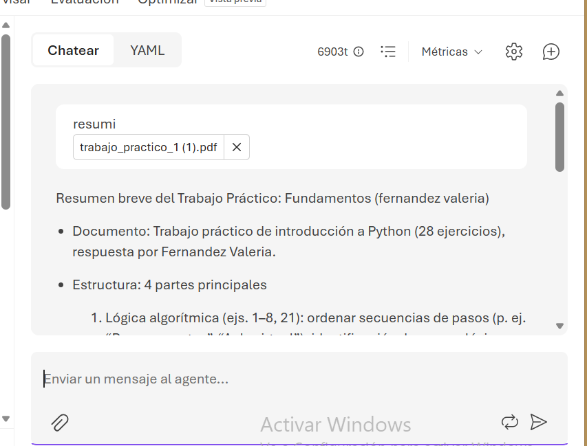

# asistente-estudio

Agente de IA creado en Microsoft Foundry que ayuda a estudiar.

## ¿Qué hace?
- Explica temas de forma clara y corta, en español.
- Si no sabe algo, lo dice.
  
## Tecnologías
- Microsoft Foundry
- Modelo gpt-5-mini

## Instrucciones del agente
"Sos un asistente que ayuda a estudiar. Respondé en español, de forma clara y corta. Si no sabés algo o tenés dudas, decímelo."

## Cómo probarlo
Escribile en el chat, por ejemplo:
- "Explicame qué es un agente de IA"
- "Resumime este texto: ..."

## Próximas mejoras
- Que tome exámenes y corrija las respuestas.
- 
 ## Ejemplo

 

## Autora
Valeria Fernández
